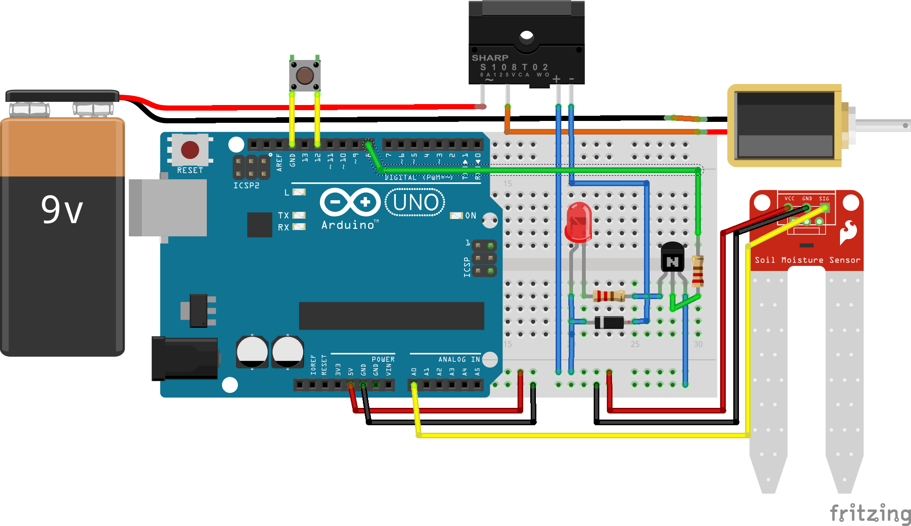

## Overview
This repository contains the code for an automated irrigation system.
The project is built using an Arduino Uno and designed to monitor the soil moisture level of an outdoor garden and switch a water valve accordingly.
	
## Documentation
#### Toolchain
Source code is written in C using the [AVR C library](https://www.nongnu.org/avr-libc/) designed for Atmel chips.
The toolchain requires avr-libc and consists of GCC for AVR to compile source into a hex file.
The machine code is then uploaded via USB to the ATmega chip using the [AVRdude](https://www.nongnu.org/avrdude/) tool. 
The build process can be seen in the provided make file.
	
#### Design
The fundamental control hardware consists of a transistor that switches a mechanical 5V relay which, in turn, switches a 12V power source actuating a solenoid water valve.
The moisture level of soil is monitered with an array of capacitive soil moisture sensors.
Once the moisture falls below a threshold, the water valve is opened and water flows into the soil until a certain level of moisture exceeds a threshold.
	
Some minor additional hardware features exist as rudimentary UI and to assist in debugging.
These include functions and a button to let the Arduino send serial data when triggered, and an LED to indicate operation status.
The Arduino Uno's onboard LED is also used for visual indication of controller status.
A circuit diagram is shown below.

Currently 2 moisture sensors are being used. Without external multiplexing, up to 6 can be used via pins A0 to A5.
	
## Notes
- This project has been deployed as a working prototype but is currently still in development.
- The circuit diagram was designed for a previous software build and is now obselete.
	
